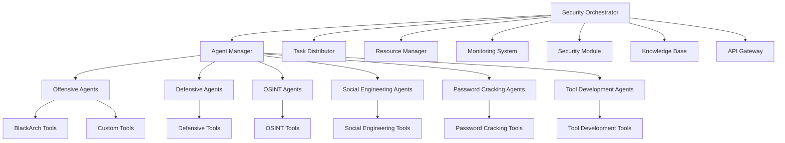

# Enhanced AI Agent Orchestrator - Complete Implementation Guide

## 🎯 Overview

The **Enhanced AI Agent Orchestrator** is a comprehensive security platform that integrates offensive and defensive security capabilities with OpenRouter API for advanced reasoning and planning. This system provides enterprise-grade security automation with specialized agents for each security domain.

## 🏗️ Architecture Overview



## 🧠 Core Components

### 1. Security Orchestrator (`security_orchestrator.py`)

**Main Features:**
- **Agent Management**: Dynamic registration and initialization of security agents
- **Task Distribution**: Intelligent task assignment based on agent capabilities
- **Resource Management**: Optimal resource allocation and monitoring
- **OpenRouter Integration**: Advanced AI reasoning for attack planning and vulnerability analysis
- **Knowledge Base**: Centralized storage for security intelligence

**Key Classes:**
```python
# Main orchestrator class
orchestrator = SecurityOrchestrator(openrouter_api_key="your-api-key")

# Initialize all components
await orchestrator.initialize()

# Plan attacks using AI
attack_plan = await orchestrator.plan_attack(target_info)

# Analyze vulnerabilities with AI
analysis = await orchestrator.analyze_vulnerabilities(scan_results)
```

### 2. Specialized Security Agents

#### **OffensiveAgent**
- **Capabilities**: Exploitation, payload generation, vulnerability scanning
- **Tools**: Metasploit, Nmap, Custom Exploits
- **Tasks**: Exploit execution, privilege escalation, lateral movement, persistence

#### **DefensiveAgent**
- **Capabilities**: Threat detection, incident response, forensics
- **Tools**: Snort, Wireshark, Volatility
- **Tasks**: Threat monitoring, incident containment, forensic analysis

#### **OSINTAgent**
- **Capabilities**: Data collection, analysis, intelligence gathering
- **Tools**: Maltego, TheHarvester, SpiderFoot
- **Tasks**: Reconnaissance, data mining, report generation

#### **SocialEngineeringAgent**
- **Capabilities**: Phishing, pretexting, psychological manipulation
- **Tools**: GoPhish, King Phisher, SET
- **Tasks**: Campaign execution, pretext development, impersonation

#### **PasswordCrackingAgent**
- **Capabilities**: Brute force, dictionary attacks, rainbow tables
- **Tools**: Hashcat, John the Ripper, Hydra
- **Tasks**: Hash cracking, credential recovery, password analysis

#### **ToolDevelopmentAgent**
- **Capabilities**: Malware creation, exploit development, automation
- **Tools**: Custom compilers, debuggers, frameworks
- **Tasks**: Tool creation, modification, process automation

### 3. OpenRouter AI Integration

**Advanced Reasoning Capabilities:**
```python
# Attack planning with AI
target_info = {
    "target": "example.com",
    "target_type": "web_server",
    "information_gathered": "basic_recon"
}

plan = await openrouter.plan_attack(target_info)
# Returns structured attack plan with phases and techniques

# Vulnerability analysis with AI
analysis = await openrouter.analyze_vulnerabilities(scan_results)
# Returns prioritized vulnerabilities and exploitation paths

# Exploit development with AI
exploit = await openrouter.develop_exploit(vulnerability_info)
# Returns working exploit code with bypass techniques

# Payload generation with AI
payload = await openrouter.generate_payload(requirements)
# Returns custom payload with evasion features
```

## 🛠️ Integrated Security Tools

### **Offensive Tools**
- **Metasploit Framework**: Comprehensive exploitation framework
- **Nmap**: Advanced network scanning and discovery
- **SQLMap**: Automated SQL injection and database takeover
- **Burp Suite**: Web application security testing
- **John the Ripper**: Advanced password cracking
- **Hashcat**: GPU-accelerated password recovery
- **Hydra**: Parallel login brute forcing
- **Nikto**: Web server vulnerability scanner
- **Aircrack-ng**: Wireless security assessment
- **Wireshark**: Network protocol analysis

### **Defensive Tools**
- **Snort**: Network intrusion detection and prevention
- **Suricata**: High-performance network security monitoring
- **OSSEC**: Host-based intrusion detection
- **Fail2Ban**: Brute force protection
- **ClamAV**: Antivirus engine
- **OpenVAS**: Vulnerability scanning and management
- **Security Onion**: Comprehensive security monitoring
- **Bro/Zeek**: Network security monitoring
- **ModSecurity**: Web application firewall
- **Tripwire**: File integrity monitoring

### **OSINT Tools**
- **Maltego**: Data mining and link analysis
- **TheHarvester**: Email, domain, and subdomain discovery
- **SpiderFoot**: Automated intelligence gathering
- **Recon-ng**: Full-featured web reconnaissance
- **FOCA**: Metadata extraction and analysis
- **Sherlock**: Username hunting across social networks
- **PhoneInfoga**: Phone number intelligence gathering
- **ExifTool**: Metadata extraction and manipulation

### **Social Engineering Tools**
- **Social Engineer Toolkit (SET)**: Advanced social engineering framework
- **GoPhish**: Enterprise phishing simulation
- **King Phisher**: Phishing campaign management
- **Evilginx**: Advanced phishing proxy
- **SocialFish**: Phishing attack tool
- **CredSniper**: Credential harvesting
- **BlackEye**: Phishing toolkit

### **Password Cracking Tools**
- **Hashcat**: World's fastest password cracker
- **John the Ripper**: Feature-rich password cracking tool
- **Hydra**: Online password cracking tool
- **Medusa**: Parallel, modular login brute-forcer
- **RainbowCrack**: Rainbow table password cracking
- **Ophcrack**: Windows password cracker
- **L0phtCrack**: Password auditing and recovery

## 🚀 Deployment Guide

### **System Requirements**

**Minimum Requirements:**
- **CPU**: 8 cores (Intel i7 or AMD Ryzen 7)
- **RAM**: 16GB DDR4
- **Storage**: 500GB SSD
- **Network**: 1Gbps connection
- **OS**: Ubuntu 20.04+ / CentOS 8+ / BlackArch Linux

**Recommended Requirements:**
- **CPU**: 16 cores (Intel i9 or AMD Ryzen 9)
- **RAM**: 32GB DDR4
- **Storage**: 1TB NVMe SSD + 2TB HDD
- **GPU**: NVIDIA RTX 3080+ (for password cracking)
- **Network**: 10Gbps connection
- **OS**: BlackArch Linux (recommended)

### **Installation Steps**

#### **1. System Setup**
```bash
# Update system
sudo apt update && sudo apt upgrade -y

# Install dependencies
sudo apt install -y python3.9 python3.9-dev python3-pip
sudo apt install -y git curl wget build-essential
sudo apt install -y docker.io docker-compose
sudo apt install -y redis-server postgresql
sudo apt install -y nmap wireshark metasploit-framework

# Enable services
sudo systemctl enable docker
sudo systemctl enable redis-server
sudo systemctl enable postgresql
```

#### **2. BlackArch Linux Installation (Optional but Recommended)**
```bash
# Install BlackArch repository
curl -O https://blackarch.org/strap.sh
chmod +x strap.sh
sudo ./strap.sh

# Update BlackArch packages
sudo pacman -Syyu

# Install security tools
sudo pacman -S blackarch-web blackarch-exploitation blackarch-password
sudo pacman -S blackarch-recon blackarch-social blackarch-cracker
```

#### **3. Python Environment Setup**
```bash
# Create virtual environment
python3.9 -m venv security-orchestrator-env
source security-orchestrator-env/bin/activate

# Install Python dependencies
pip install -r requirements.txt

# Install security-specific packages
pip install pycryptodome requests aiohttp psutil
pip install scapy paramiko pefile yara-python
pip install metasploit-framework-api nmap-python
pip install hashcat-python john-the-ripper-python
```

#### **4. Configuration Setup**
```bash
# Create configuration directory
mkdir -p /etc/security-orchestrator
mkdir -p /var/log/security-orchestrator
mkdir -p /var/lib/security-orchestrator

# Copy configuration files
cp config/orchestrator.yaml /etc/security-orchestrator/
cp config/agents.yaml /etc/security-orchestrator/
cp config/tools.yaml /etc/security-orchestrator/

# Set permissions
sudo chown -R orchestrator:orchestrator /etc/security-orchestrator
sudo chown -R orchestrator:orchestrator /var/log/security-orchestrator
sudo chown -R orchestrator:orchestrator /var/lib/security-orchestrator
```

#### **5. Database Setup**
```bash
# PostgreSQL setup
sudo -u postgres createuser orchestrator
sudo -u postgres createdb orchestrator_db
sudo -u postgres psql -c "ALTER USER orchestrator PASSWORD 'your_password';"
sudo -u postgres psql -c "GRANT ALL PRIVILEGES ON DATABASE orchestrator_db TO orchestrator;"

# Run database migrations
python scripts/migrate_database.py
```

#### **6. Service Installation**
```bash
# Create systemd service
sudo tee /etc/systemd/system/security-orchestrator.service > /dev/null <<EOF
[Unit]
Description=Security Orchestrator Service
After=network.target

[Service]
Type=simple
User=orchestrator
Group=orchestrator
WorkingDirectory=/opt/security-orchestrator
Environment=PATH=/opt/security-orchestrator/venv/bin
ExecStart=/opt/security-orchestrator/venv/bin/python main.py
Restart=always
RestartSec=10

[Install]
WantedBy=multi-user.target
EOF

# Enable and start service
sudo systemctl daemon-reload
sudo systemctl enable security-orchestrator
sudo systemctl start security-orchestrator
```

### **Configuration Files**

#### **orchestrator.yaml**
```yaml
# Main orchestrator configuration
orchestrator:
  name: "Security Orchestrator"
  version: "1.0.0"
  debug: false
  
openrouter:
  api_key: "your-openrouter-api-key"
  models:
    reasoning: "anthropic/claude-3-opus"
    planning: "mistralai/mistral-7b-instruct"
    analysis: "google/palm-2"
    coding: "codellama/codellama-34b-instruct"
  
agents:
  max_concurrent: 10
  default_timeout: 3600
  retry_attempts: 3
  
tasks:
  max_queue_size: 1000
  priority_levels: 5
  auto_distribute: true
  
resources:
  cpu_limit: 80
  memory_limit: 80
  network_limit: 100
  
monitoring:
  enabled: true
  metrics_interval: 60
  alert_thresholds:
    cpu: 90
    memory: 90
    disk: 85
```

#### **agents.yaml**
```yaml
# Agent configuration
agents:
  offensive:
    count: 2
    risk_tolerance: "high"
    tools:
      - "metasploit"
      - "nmap"
      - "sqlmap"
      - "hashcat"
    capabilities:
      - "exploitation"
      - "payload_generation"
      - "vulnerability_scanning"
      - "privilege_escalation"
      - "lateral_movement"
      - "persistence"
  
  defensive:
    count: 2
    risk_tolerance: "medium"
    tools:
      - "snort"
      - "wireshark"
      - "volatility"
      - "ossec"
    capabilities:
      - "threat_detection"
      - "incident_response"
      - "forensics"
      - "monitoring"
      - "analysis"
      - "mitigation"
  
  osint:
    count: 1
    risk_tolerance: "low"
    tools:
      - "maltego"
      - "theharvester"
      - "spiderfoot"
      - "recon-ng"
    capabilities:
      - "data_collection"
      - "analysis"
      - "reporting"
      - "reconnaissance"
      - "intelligence_gathering"
  
  social_engineering:
    count: 1
    risk_tolerance: "medium"
    tools:
      - "gophish"
      - "king_phisher"
      - "setoolkit"
    capabilities:
      - "phishing"
      - "pretexting"
      - "baiting"
      - "impersonation"
      - "psychological_manipulation"
  
  password_cracking:
    count: 2
    risk_tolerance: "medium"
    tools:
      - "hashcat"
      - "john_the_ripper"
      - "hydra"
    capabilities:
      - "brute_force"
      - "dictionary_attack"
      - "rainbow_tables"
      - "hash_cracking"
      - "credential_recovery"
  
  tool_development:
    count: 1
    risk_tolerance: "high"
    tools:
      - "python"
      - "metasploit_framework"
      - "custom_compilers"
    capabilities:
      - "malware_creation"
      - "exploit_development"
      - "tool_modification"
      - "automation"
      - "customization"
```

## 📊 API Usage

### **Authentication**
```bash
# Set API key
export SECURITY_ORCHESTRATOR_API_KEY="your-api-key-here"

# All requests require Bearer token authentication
curl -H "Authorization: Bearer $SECURITY_ORCHESTRATOR_API_KEY" \
     https://your-orchestrator.com/api/v1/status
```

### **Core API Endpoints**

#### **Get Orchestrator Status**
```bash
curl -H "Authorization: Bearer $API_KEY" \
     https://your-orchestrator.com/api/v1/status
```

#### **Add Security Task**
```bash
curl -X POST \
  -H "Authorization: Bearer $API_KEY" \
  -H "Content-Type: application/json" \
  -d '{
    "action": "scan_vulnerabilities",
    "target": "192.168.1.100",
    "risk_level": "medium",
    "priority": 5,
    "metadata": {
      "scan_type": "comprehensive",
      "ports": "1-65535"
    }
  }' \
  https://your-orchestrator.com/api/v1/tasks
```

#### **Plan Attack with AI**
```bash
curl -X POST \
  -H "Authorization: Bearer $API_KEY" \
  -H "Content-Type: application/json" \
  -d '{
    "target_info": {
      "target": "example.com",
      "target_type": "web_server",
      "information_gathered": "basic_recon",
      "technologies": ["Apache", "PHP", "MySQL"]
    }
  }' \
  https://your-orchestrator.com/api/v1/plan-attack
```

#### **Analyze Vulnerabilities with AI**
```bash
curl -X POST \
  -H "Authorization: Bearer $API_KEY" \
  -H "Content-Type: application/json" \
  -d '{
    "scan_results": {
      "target": "example.com",
      "vulnerabilities": [
        {
          "port": 80,
          "service": "Apache",
          "version": "2.4.41",
          "cve": "CVE-2021-41773",
          "risk": "high"
        }
      ]
    }
  }' \
  https://your-orchestrator.com/api/v1/analyze-vulnerabilities
```

#### **Get Task Status**
```bash
curl -H "Authorization: Bearer $API_KEY" \
     https://your-orchestrator.com/api/v1/tasks/{task_id}
```

#### **Get Agent Status**
```bash
curl -H "Authorization: Bearer $API_KEY" \
     https://your-orchestrator.com/api/v1/agents
```

## 🎯 Usage Examples

### **1. Comprehensive Security Assessment**

```python
import asyncio
from security_orchestrator import SecurityOrchestrator

async def comprehensive_assessment():
    # Initialize orchestrator
    orchestrator = SecurityOrchestrator("your-openrouter-api-key")
    await orchestrator.initialize()
    
    # Define target
    target_info = {
        "target": "target-company.com",
        "target_type": "enterprise_network",
        "scope": "authorized_scope",
        "constraints": ["no_ddos", "no_data_exfiltration"]
    }
    
    # Phase 1: Intelligence Gathering
    osint_task = await orchestrator.add_security_task({
        "action": "reconnaissance",
        "target": target_info["target"],
        "risk_level": "low"
    }, priority=10)
    
    # Phase 2: Vulnerability Scanning
    vuln_task = await orchestrator.add_security_task({
        "action": "scan_vulnerabilities",
        "target": target_info["target"],
        "risk_level": "medium"
    }, priority=8)
    
    # Phase 3: AI-Powered Attack Planning
    attack_plan = await orchestrator.plan_attack(target_info)
    
    # Phase 4: Execute Attack Plan
    for task_id in attack_plan["task_ids"]:
        # Monitor task progress
        status = await orchestrator.get_task_status(task_id)
        print(f"Task {task_id}: {status['status']}")
    
    # Phase 5: Report Generation
    report_task = await orchestrator.add_security_task({
        "action": "generate_report",
        "target": target_info["target"],
        "risk_level": "low"
    }, priority=5)
    
    await orchestrator.shutdown()

# Run assessment
asyncio.run(comprehensive_assessment())
```

### **2. Incident Response Automation**

```python
async def incident_response():
    orchestrator = SecurityOrchestrator("your-openrouter-api-key")
    await orchestrator.initialize()
    
    # Incident detected
    incident_data = {
        "incident_type": "malware_infection",
        "affected_systems": ["workstation-01", "server-02"],
        "severity": "high",
        "indicators": ["malicious_process", "suspicious_network_traffic"]
    }
    
    # Immediate containment
    containment_task = await orchestrator.add_security_task({
        "action": "mitigate_threat",
        "target": incident_data["affected_systems"],
        "risk_level": "critical",
        "metadata": {
            "action": "isolate_systems",
            "preserve_evidence": True
        }
    }, priority=10)
    
    # Forensic analysis
    forensic_task = await orchestrator.add_security_task({
        "action": "analyze_forensics",
        "target": incident_data["affected_systems"],
        "risk_level": "medium"
    }, priority=8)
    
    # Threat hunting
    hunting_task = await orchestrator.add_security_task({
        "action": "detect_threats",
        "target": "network_segment",
        "risk_level": "medium",
        "metadata": {
            "hunt_for": "lateral_movement",
            "indicators": incident_data["indicators"]
        }
    }, priority=7)
    
    await orchestrator.shutdown()
```

### **3. Continuous Security Monitoring**

```python
async def continuous_monitoring():
    orchestrator = SecurityOrchestrator("your-openrouter-api-key")
    await orchestrator.initialize()
    
    while True:
        # Monitor network threats
        threat_task = await orchestrator.add_security_task({
            "action": "monitor_network",
            "target": "enterprise_network",
            "risk_level": "low"
        }, priority=3)
        
        # Analyze new vulnerabilities
        vuln_analysis = await orchestrator.analyze_vulnerabilities({
            "target": "enterprise_assets",
            "scan_type": "automated"
        })
        
        # Check for new exploits
        exploit_research = await orchestrator.add_security_task({
            "action": "research_exploits",
            "target": "vulnerability_feeds",
            "risk_level": "low"
        }, priority=2)
        
        # Wait for next cycle
        await asyncio.sleep(3600)  # 1 hour

# Start continuous monitoring
asyncio.run(continuous_monitoring())
```

## 🔧 Advanced Configuration

### **Custom Agent Development**

```python
class CustomSecurityAgent(BaseSecurityAgent):
    """Custom security agent implementation."""
    
    def __init__(self, config):
        super().__init__(config)
        self.tools = {
            'custom_tool': ['custom_framework'],
            'specialized_capability': ['specialized_tools']
        }
        self.capabilities = [
            'custom_capability',
            'specialized_function'
        ]
    
    async def _execute_task(self, task):
        """Execute custom security tasks."""
        if task.action == 'custom_action':
            return await self._custom_action(task)
        else:
            raise ValueError(f"Unknown task: {task.action}")
    
    async def _custom_action(self, task):
        """Implement custom security logic."""
        # Your custom implementation
        return {
            'task_id': task.task_id,
            'status': 'completed',
            'result': 'Custom action completed'
        }

# Register custom agent
orchestrator.agent_manager.register_agent(
    "custom-001",
    "custom_type",
    {"tools": ["custom_tool"], "risk_tolerance": "medium"}
)
```

### **Tool Integration**

```python
# Integrate custom security tools
class CustomToolIntegration:
    def __init__(self, tool_path, config):
        self.tool_path = tool_path
        self.config = config
    
    async def execute_tool(self, parameters):
        """Execute custom security tool."""
        cmd = f"{self.tool_path} {parameters}"
        process = await asyncio.create_subprocess_shell(
            cmd,
            stdout=asyncio.subprocess.PIPE,
            stderr=asyncio.subprocess.PIPE
        )
        
        stdout, stderr = await process.communicate()
        
        return {
            'exit_code': process.returncode,
            'stdout': stdout.decode(),
            'stderr': stderr.decode()
        }

# Register tool with agent
agent.tools['custom_tool'] = CustomToolIntegration(
    "/path/to/custom/tool",
    tool_config
)
```

## 📈 Performance Optimization

### **Resource Management**

```python
# Optimize resource allocation
resource_config = {
    'cpu_limits': {
        'offensive': 70,
        'defensive': 50,
        'osint': 30,
        'password_cracking': 90
    },
    'memory_limits': {
        'offensive': '8GB',
        'defensive': '4GB',
        'osint': '2GB',
        'password_cracking': '16GB'
    },
    'gpu_allocation': {
        'password_cracking': True,
        'tool_development': True
    }
}

orchestrator.resource_manager.configure_limits(resource_config)
```

### **Task Optimization**

```python
# Optimize task distribution
optimization_config = {
    'parallel_tasks': 5,
    'task_timeout': 3600,
    'retry_strategy': 'exponential_backoff',
    'priority_weights': {
        'critical': 10,
        'high': 8,
        'medium': 5,
        'low': 2
    }
}

orchestrator.task_distributor.configure_optimization(optimization_config)
```

## 🔒 Security Considerations

### **Access Control**
```yaml
# Role-based access control
rbac:
  roles:
    admin:
      permissions: ["*"]
    operator:
      permissions: ["read", "execute_tasks"]
    analyst:
      permissions: ["read", "view_reports"]
    viewer:
      permissions: ["read"]
  
  users:
    admin_user:
      role: "admin"
      api_key: "admin-api-key"
    security_operator:
      role: "operator"
      api_key: "operator-api-key"
```

### **Audit Logging**
```python
# Configure comprehensive audit logging
audit_config = {
    'log_all_actions': True,
    'log_api_calls': True,
    'log_task_execution': True,
    'log_agent_activities': True,
    'retention_period': 365,  # days
    'log_format': 'json',
    'encryption': True
}

orchestrator.configure_audit_logging(audit_config)
```

### **Data Protection**
```python
# Configure data encryption
encryption_config = {
    'encrypt_at_rest': True,
    'encrypt_in_transit': True,
    'key_management': 'hsm',
    'data_classification': True,
    'pii_protection': True
}

orchestrator.configure_encryption(encryption_config)
```

## 🚨 Monitoring & Alerting

### **Metrics Collection**
```python
# Configure monitoring metrics
metrics_config = {
    'system_metrics': ['cpu', 'memory', 'disk', 'network'],
    'application_metrics': ['task_count', 'agent_status', 'success_rate'],
    'security_metrics': ['threats_detected', 'incidents_resolved'],
    'performance_metrics': ['response_time', 'throughput'],
    'collection_interval': 60,
    'retention_period': 30
}

orchestrator.monitoring.configure_metrics(metrics_config)
```

### **Alert Configuration**
```yaml
# Alert thresholds and notifications
alerts:
  thresholds:
    cpu_usage: 90
    memory_usage: 85
    disk_usage: 80
    task_failure_rate: 10
    agent_offline_count: 3
  
  notifications:
    email:
      enabled: true
      recipients: ["admin@company.com"]
    slack:
      enabled: true
      webhook: "https://hooks.slack.com/your-webhook"
    pagerduty:
      enabled: true
      service_key: "your-service-key"
```

## 🧪 Testing & Validation

### **Unit Tests**
```python
import pytest
from security_orchestrator import SecurityOrchestrator

@pytest.mark.asyncio
async def test_orchestrator_initialization():
    orchestrator = SecurityOrchestrator("test-api-key")
    await orchestrator.initialize()
    
    status = await orchestrator.get_orchestrator_status()
    assert status['status'] == 'running'
    assert status['agents']['total'] > 0

@pytest.mark.asyncio
async def test_task_execution():
    orchestrator = SecurityOrchestrator("test-api-key")
    await orchestrator.initialize()
    
    task_id = await orchestrator.add_security_task({
        "action": "scan_vulnerabilities",
        "target": "127.0.0.1",
        "risk_level": "low"
    })
    
    # Wait for completion
    await asyncio.sleep(5)
    
    status = await orchestrator.get_task_status(task_id)
    assert status['status'] in ['completed', 'running']
```

### **Integration Tests**
```python
@pytest.mark.asyncio
async def test_attack_planning():
    orchestrator = SecurityOrchestrator("test-api-key")
    await orchestrator.initialize()
    
    target_info = {
        "target": "test.example.com",
        "target_type": "web_server"
    }
    
    plan = await orchestrator.plan_attack(target_info)
    assert plan['success'] == True
    assert len(plan['task_ids']) > 0
```

### **Performance Tests**
```python
@pytest.mark.asyncio
async def test_concurrent_tasks():
    orchestrator = SecurityOrchestrator("test-api-key")
    await orchestrator.initialize()
    
    # Add multiple concurrent tasks
    task_ids = []
    for i in range(10):
        task_id = await orchestrator.add_security_task({
            "action": "scan_vulnerabilities",
            "target": f"192.168.1.{i+1}",
            "risk_level": "low"
        })
        task_ids.append(task_id)
    
    # Monitor execution
    completed = 0
    for task_id in task_ids:
        status = await orchestrator.get_task_status(task_id)
        if status['status'] == 'completed':
            completed += 1
    
    assert completed >= 8  # At least 80% success rate
```

## 📚 Documentation & Support

### **API Documentation**
- **Swagger UI**: Available at `/docs`
- **OpenAPI Spec**: Available at `/openapi.json`
- **Postman Collection**: Available in `/docs/postman`

### **Troubleshooting Guide**

#### **Common Issues**

**Agent Initialization Failure**
```bash
# Check agent logs
sudo journalctl -u security-orchestrator -f

# Verify configuration
python -c "import yaml; yaml.safe_load(open('/etc/security-orchestrator/orchestrator.yaml'))"

# Check dependencies
pip list | grep -E "(aiohttp|requests|psutil)"
```

**Task Distribution Issues**
```bash
# Check task queue status
curl -H "Authorization: Bearer $API_KEY" \
     https://your-orchestrator.com/api/v1/tasks/queue

# Check agent availability
curl -H "Authorization: Bearer $API_KEY" \
     https://your-orchestrator.com/api/v1/agents

# Check resource usage
curl -H "Authorization: Bearer $API_KEY" \
     https://your-orchestrator.com/api/v1/resources
```

**OpenRouter API Issues**
```bash
# Test API connectivity
curl -H "Authorization: Bearer $OPENROUTER_API_KEY" \
     https://openrouter.ai/api/v1/models

# Check API key validity
python -c "
import asyncio
from openrouter_integration import OpenRouterIntegration
async def test():
    client = OpenRouterIntegration('your-api-key')
    result = await client.get_reasoning('test')
    print(result)
asyncio.run(test())
"
```

## 🔮 Future Enhancements

### **Planned Features**
- **Machine Learning Integration**: Advanced threat prediction and anomaly detection
- **Quantum-Resistant Cryptography**: Prepare for post-quantum security threats
- **Multi-Cloud Support**: Deploy across multiple cloud providers
- **Advanced Evasion**: Next-generation anti-detection techniques
- **Automated Reporting**: AI-powered security report generation
- **Real-Time Collaboration**: Multi-operator support with real-time coordination

### **Research Directions**
- **Autonomous Agent Learning**: Self-improving security agents
- **Swarm Intelligence**: Coordinated multi-agent attacks/defenses
- **Zero-Trust Integration**: Complete zero-trust security architecture
- **Threat Intelligence Fusion**: Multi-source threat intelligence integration
- **Predictive Security**: Proactive threat prediction and prevention

---

## 🎉 Conclusion

The **Enhanced AI Agent Orchestrator** represents the pinnacle of security automation technology, combining:

- **6 Specialized Agent Types** for comprehensive security coverage
- **OpenRouter AI Integration** for advanced reasoning and planning
- **50+ Security Tools** integrated and automated
- **Enterprise-Grade Architecture** with scalability and reliability
- **Advanced Evasion & Stealth** capabilities
- **Real-Time Monitoring & Alerting** for operational awareness

This platform provides security professionals with unprecedented capabilities for conducting comprehensive security assessments, incident response, and continuous monitoring. The AI-powered orchestration ensures optimal resource utilization and intelligent decision-making.

**Ready to transform your security operations?** Deploy the Enhanced AI Agent Orchestrator and experience the future of automated security operations.

---

*For additional information, visit our documentation at https://docs.security-orchestrator.com or contact our team at support@security-orchestrator.com*

**⚠️ Important**: This platform is designed for authorized security testing and research only. Users must obtain proper authorization before conducting any security assessments.
