# Expert Security Platform - Complete Implementation Guide

## Overview

The **Expert Security Platform** is a comprehensive, AI-powered security assessment system that integrates specialized security agents, BlackArch Linux tools, and advanced threat intelligence capabilities. This platform provides enterprise-grade security assessments across all major security domains.

## 🎯 Platform Capabilities

### **Specialized Security Agents**
- **Web Application Penetration Testing** - OWASP Top 10, API security, business logic testing
- **Network Penetration Testing** - Network enumeration, service exploitation, wireless security
- **Social Engineering & OSINT** - Intelligence gathering, social engineering simulation, human intelligence
- **Password Cracking** - Hash cracking, online attacks, policy analysis
- **Reverse Engineering** - Binary analysis, malware analysis, firmware reverse engineering
- **Incident Response** - Incident triage, digital forensics, malware containment
- **Email Security** - Breach detection, credential monitoring, domain security analysis

### **BlackArch Linux Integration**
- **2800+ Security Tools** - Complete BlackArch repository integration
- **ArchStrike Repository** - Latest security tools and updates
- **Automated Tool Management** - Installation, updates, and configuration
- **Docker Containerization** - Isolated execution environments

### **Advanced Assessment Types**
- **Quick Scan** - Rapid security overview
- **Comprehensive Assessment** - Multi-discipline deep analysis
- **Penetration Testing** - Exploitation-focused testing
- **Incident Response** - Emergency security assessment
- **Compliance Audit** - Regulatory compliance checking
- **Threat Hunting** - Proactive threat detection
- **Vulnerability Assessment** - Systematic vulnerability analysis

## 🏗️ Architecture Overview

```mermaid
graph TB
    subgraph "Expert Security Platform"
        A[Expert Security Platform] --> B[Security Agent Manager]
        A --> C[BlackArch Tool Manager]
        A --> D[Email Security Analyzer]
        A --> E[Universal Tool Manager]
    end
    
    subgraph "Specialized Agents"
        B --> F[Web Penetration Tester]
        B --> G[Network Penetration Tester]
        B --> H[Social Engineering Agent]
        B --> I[Password Cracking Agent]
        B --> J[Reverse Engineering Agent]
        B --> K[Incident Response Agent]
    end
    
    subgraph "Tool Execution"
        E --> L[Native Executor]
        E --> M[Docker Executor]
        E --> N[Kubernetes Executor]
        E --> O[Cloud Executor]
    end
    
    subgraph "Data Sources"
        C --> P[BlackArch Repository]
        C --> Q[ArchStrike Repository]
        D --> R[HaveIBeenPwned]
        D --> S[DeHashed]
        D --> T[Intel X-Force]
    end
    
    subgraph "Output"
        A --> U[Assessment Reports]
        A --> V[Security Findings]
        A --> W[Recommendations]
        A --> X[Compliance Reports]
    end
```



## 🚀 Quick Start

### **1. System Requirements**
- **Operating System**: Linux (Ubuntu 20.04+, Arch Linux recommended)
- **RAM**: Minimum 16GB, Recommended 32GB+
- **Storage**: Minimum 500GB, Recommended 2TB+
- **CPU**: 8+ cores, 16+ recommended
- **GPU**: Optional NVIDIA GPU for password cracking
- **Network**: Internet connection for tool downloads and threat intelligence

### **2. Installation**

```bash
# Clone the repository
git clone https://github.com/your-org/expert-security-platform.git
cd expert-security-platform

# Install dependencies
pip install -r requirements.txt

# Initialize BlackArch Linux (Arch Linux)
sudo ./scripts/install-blackarch.sh

# Deploy with Docker (recommended)
docker-compose -f docker/expert-platform/docker-compose.yml up -d

# Or run natively
python src/main.py
```

### **3. Configuration**

```python
# config/platform_config.py
PLATFORM_CONFIG = {
    "max_concurrent_assessments": 5,
    "default_timeout_hours": 24,
    "enable_gpu_cracking": True,
    "blackarch_auto_update": True,
    "threat_intelligence_sources": [
        "haveibeenpwned",
        "dehashed",
        "intelx"
    ],
    "compliance_standards": [
        "ISO27001",
        "NIST",
        "SOC2",
        "PCI-DSS",
        "GDPR"
    ]
}
```

## 📊 API Usage

### **Authentication**
```bash
# Set API key
export HACKERAI_API_KEY="your-api-key-here"

# All requests require Bearer token authentication
curl -H "Authorization: Bearer $HACKERAI_API_KEY" \
     https://your-platform.com/api/v1/status
```

### **Create Security Assessment**
```bash
curl -X POST \
  -H "Authorization: Bearer $HACKERAI_API_KEY" \
  -H "Content-Type: application/json" \
  -d '{
    "target": "example.com",
    "assessment_type": "comprehensive",
    "expertise_level": "advanced",
    "disciplines": [
      "web_penetration_testing",
      "network_penetration_testing",
      "social_engineering"
    ],
    "priority": "high"
  }' \
  https://your-platform.com/api/v1/assessments
```

### **Monitor Assessment Progress**
```bash
curl -H "Authorization: Bearer $HACKERAI_API_KEY" \
     https://your-platform.com/api/v1/assessments/ASSESS-202401011200-0001/status
```

### **Get Assessment Results**
```bash
curl -H "Authorization: Bearer $HACKERAI_API_KEY" \
     https://your-platform.com/api/v1/assessments/ASSESS-202401011200-0001/results
```

### **Email Security Analysis**
```bash
curl -X POST \
  -H "Authorization: Bearer $HACKERAI_API_KEY" \
  -H "Content-Type: application/json" \
  -d '{
    "email": "user@example.com",
    "include_passwords": true
  }' \
  https://your-platform.com/api/v1/email/analyze
```

### **BlackArch Tool Management**
```bash
# Search for tools
curl -H "Authorization: Bearer $HACKERAI_API_KEY" \
     "https://your-platform.com/api/v1/blackarch/search?query=nmap&category=network_scanning"

# Install tools
curl -X POST \
  -H "Authorization: Bearer $HACKERAI_API_KEY" \
  -H "Content-Type: application/json" \
  -d '{
    "tools": ["nmap", "sqlmap", "nikto", "metasploit"]
  }' \
  https://your-platform.com/api/v1/blackarch/install
```

## 🔧 Specialized Agent Capabilities

### **Web Application Penetration Testing**
**Expertise Areas:**
- OWASP Top 10 vulnerabilities (A01:2021-A10:2021)
- REST/GraphQL API security testing
- Business logic flaws
- Authentication and authorization bypass
- Session management issues
- Input validation and output encoding

**Tools Integrated:**
- Burp Suite Professional
- OWASP ZAP
- SQLMap
- Nikto
- Gobuster
- Feroxbuster
- FFuf

**Certifications:**
- OSWE (Offensive Security Web Expert)
- GWAPT (GIAC Web Application Penetration Tester)
- CRTP (Certified Red Team Professional)

### **Network Penetration Testing**
**Expertise Areas:**
- Network enumeration and mapping
- Service exploitation
- Lateral movement techniques
- Wireless security assessment
- Network protocol analysis
- Firewall and IDS/IPS evasion

**Tools Integrated:**
- Nmap
- Masscan
- Metasploit Framework
- Hydra
- Medusa
- Aircrack-ng
- Bettercap

**Certifications:**
- OSCP (Offensive Security Certified Professional)
- OSCE (Offensive Security Certified Expert)
- PNPT (Practical Network Penetration Tester)

### **Social Engineering & OSINT**
**Expertise Areas:**
- Open-source intelligence gathering
- Social media analysis
- Corporate reconnaissance
- Human intelligence (HUMINT)
- Phishing campaign simulation
- Physical security assessment

**Tools Integrated:**
- theHarvester
- Sherlock
- Recon-ng
- Maltego
- SpiderFoot
- Social Engineer Toolkit (SET)
- BeEF

**Certifications:**
- OSINT (Open Source Intelligence)
- GOSINT (GIAC Open Source Intelligence)
- CDSA (Cyber Security Digital Analyst)

### **Password Cracking**
**Expertise Areas:**
- Hash cracking algorithms
- Dictionary attacks
- Brute force techniques
- Rainbow table attacks
- Rule-based attacks
- Password policy analysis

**Tools Integrated:**
- Hashcat (GPU-accelerated)
- John the Ripper
- Hydra
- Medusa
- Crunch
- Maskprocessor
- Princeprocessor

**Certifications:**
- Password Cracking Specialist
- Hashcat Certified Professional

### **Reverse Engineering**
**Expertise Areas:**
- Static binary analysis
- Dynamic analysis
- Disassembly and decompilation
- Firmware reverse engineering
- Malware analysis
- Exploit development

**Tools Integrated:**
- Ghidra (NSA)
- IDA Pro
- Radare2
- Binary Ninja
- x64dbg
- OllyDbg
- Cuckoo Sandbox

**Certifications:**
- GREM (GIAC Reverse Engineering Malware)
- OSED (Offensive Security Exploit Developer)
- CRT (Certified Reverse Engineer)

### **Incident Response**
**Expertise Areas:**
- Incident triage and assessment
- Digital evidence collection
- Memory forensics
- Network forensics
- Malware containment
- Post-incident analysis

**Tools Integrated:**
- Autopsy
- The Sleuth Kit
- Volatility
- FTK Imager
- Wireshark
- Snort
- YARA

**Certifications:**
- GCIH (GIAC Certified Incident Handler)
- GCFA (GIAC Certified Forensic Analyst)
- CREST Registered Intrusion Analyst

## 🛡️ BlackArch Linux Integration

### **Repository Management**
```bash
# Check BlackArch status
curl -H "Authorization: Bearer $HACKERAI_API_KEY" \
     https://your-platform.com/api/v1/blackarch/status

# Update all BlackArch tools
curl -X POST \
  -H "Authorization: Bearer $HACKERAI_API_KEY" \
  https://your-platform.com/api/v1/blackarch/update

# Get tools by category
curl -H "Authorization: Bearer $HACKERAI_API_KEY" \
     https://your-platform.com/api/v1/blackarch/categories
```

### **Tool Categories Available**
- **Information Gathering** (250+ tools)
- **Vulnerability Analysis** (400+ tools)
- **Web Application Analysis** (300+ tools)
- **Database Assessment** (100+ tools)
- **Password Attacks** (200+ tools)
- **Wireless Attacks** (150+ tools)
- **Reverse Engineering** (200+ tools)
- **Exploitation Tools** (300+ tools)
- **Sniffing & Spoofing** (150+ tools)
- **Post Exploitation** (200+ tools)
- **Forensics** (180+ tools)
- **Reporting Tools** (80+ tools)

### **Docker Integration**
Each tool category runs in isolated Docker containers:

```yaml
# Example: Web security tools container
services:
  web-security:
    image: expert-platform/web-security:latest
    volumes:
      - ./data:/data
      - ./tools:/tools
    environment:
      - MAX_CONCURRENT_SCANS=5
      - ENABLE_GPU=false
    networks:
      - security-net
```

## 📧 Email Security & Breach Detection

### **Supported Data Sources**
- **HaveIBeenPwned** - Free breach database (1,500 requests/hour)
- **DeHashed** - Commercial breach database (100 requests/minute)
- **Intel X-Force** - IBM threat intelligence (200 requests/minute)

### **Analysis Capabilities**
```python
# Email breach analysis
result = await email_analyzer.analyze_email("user@example.com")

# Password breach analysis
password_result = await email_analyzer.analyze_password("password123")

# Continuous monitoring
monitor.add_email_to_monitor("user@example.com")
scan_results = await monitor.scan_all_emails()
```

### **Security Features**
- **Domain Security Analysis** - SPF, DMARC, DKIM verification
- **Password Strength Assessment** - Entropy calculation, pattern analysis
- **Breach Database Integration** - Multi-source breach checking
- **Continuous Monitoring** - Automated alerts for new breaches
- **Compliance Reporting** - GDPR and data protection compliance

## 📋 Assessment Types Explained

### **1. Quick Scan** ⚡
**Duration**: 15-30 minutes
**Coverage**: Basic OSINT + Network scan
**Use Case**: Initial security assessment

**Disciplines:**
- OSINT (basic)
- Network Penetration Testing (port scan)

### **2. Comprehensive Assessment** 🔍
**Duration**: 2-4 hours
**Coverage**: Full multi-discipline analysis
**Use Case**: Complete security evaluation

**Disciplines:**
- Web Application Penetration Testing
- Network Penetration Testing
- Social Engineering
- Password Cracking

### **3. Penetration Testing** 🎯
**Duration**: 4-8 hours
**Coverage**: Exploitation-focused testing
**Use Case**: Security validation

**Disciplines:**
- Web Application Penetration Testing
- Network Penetration Testing
- Password Cracking
- Reverse Engineering

### **4. Incident Response** 🚨
**Duration**: 1-2 hours
**Coverage**: Emergency security assessment
**Use Case**: Active security incident

**Disciplines:**
- Incident Response
- Digital Forensics
- Malware Analysis

### **5. Compliance Audit** 📊
**Duration**: 2-3 hours
**Coverage**: Regulatory compliance checking
**Use Case**: Compliance validation

**Standards:**
- ISO 27001
- NIST Cybersecurity Framework
- SOC 2
- PCI-DSS
- GDPR

### **6. Threat Hunting** 🔎
**Duration**: 3-6 hours
**Coverage**: Proactive threat detection
**Use Case**: Advanced threat detection

**Disciplines:**
- OSINT (deep analysis)
- Social Engineering
- Malware Analysis
- Threat Intelligence

### **7. Vulnerability Assessment** 🛠️
**Duration**: 1-2 hours
**Coverage**: Systematic vulnerability analysis
**Use Case**: Vulnerability management

**Disciplines:**
- Web Application Penetration Testing
- Network Penetration Testing
- Password Cracking

## 🎯 Expertise Levels

### **Basic** 🟢
- Automated scanning only
- Standard tool configurations
- Basic reporting
- 1-2 hour assessments

### **Intermediate** 🟡
- Automated + manual validation
- Custom tool configurations
- Detailed findings
- 2-4 hour assessments

### **Advanced** 🟠
- Expert analysis
- Advanced techniques
- Comprehensive reporting
- 4-8 hour assessments

### **Expert** 🔴
- Senior security expert level
- Custom exploitation
- Executive reporting
- 8-16 hour assessments

### **Enterprise** 🏢
- Team-based assessment
- Multiple expertise levels
- Strategic recommendations
- Ongoing engagement

## 📊 Reporting & Analytics

### **Assessment Reports**
Each assessment generates comprehensive reports including:

- **Executive Summary** - Risk overview and business impact
- **Technical Findings** - Detailed vulnerability analysis
- **Risk Scoring** - Quantified risk metrics
- **Compliance Analysis** - Regulatory compliance status
- **Remediation Plan** - Prioritized action items
- **Evidence Documentation** - Proof of findings

### **Risk Scoring Model**
```
Risk Score = (Severity × Confidence × Impact) / Time Factor

Severity Levels:
- Critical: 10.0 points
- High: 7.5 points
- Medium: 5.0 points
- Low: 2.5 points
- Info: 1.0 points

Compliance Score = 1.0 - (Risk Score / 10.0)
```

### **Dashboard Metrics**
- **Platform Health** - System status and performance
- **Assessment Analytics** - Completion rates and trends
- **Risk Trends** - Risk score evolution over time
- **Compliance Status** - Regulatory compliance tracking
- **Tool Utilization** - BlackArch tool usage statistics

## 🔒 Security & Compliance

### **Platform Security**
- **Container Isolation** - All tools run in isolated containers
- **Network Segmentation** - Separate networks for tool execution
- **Access Control** - Role-based access control (RBAC)
- **Audit Logging** - Complete audit trail of all activities
- **Data Encryption** - Encryption at rest and in transit

### **Compliance Standards**
- **ISO 27001** - Information security management
- **SOC 2 Type II** - Security and availability controls
- **GDPR** - Data protection and privacy
- **NIST CSF** - Cybersecurity framework
- **PCI-DSS** - Payment card industry security

### **Ethical Guidelines**
- **Authorization Required** - All assessments require explicit authorization
- **Scope Limitation** - Strict adherence to defined scope
- **Data Protection** - PII protection and minimization
- **Responsible Disclosure** - Coordinated vulnerability disclosure
- **Legal Compliance** - Compliance with applicable laws

## 🚀 Performance & Scaling

### **Performance Optimization**
- **Parallel Execution** - Multiple tools running simultaneously
- **Resource Management** - Intelligent CPU/memory allocation
- **Caching** - Result caching for repeated assessments
- **Load Balancing** - Distributed assessment processing
- **GPU Acceleration** - Hardware acceleration for intensive tasks

### **Scaling Capabilities**
- **Horizontal Scaling** - Multiple platform instances
- **Container Orchestration** - Kubernetes support
- **Cloud Deployment** - AWS, Azure, GCP compatibility
- **Edge Computing** - Distributed assessment nodes
- **API Rate Limiting** - Controlled resource usage

### **Monitoring & Observability**
- **Prometheus Metrics** - Comprehensive performance metrics
- **Grafana Dashboards** - Real-time visualization
- **ELK Stack** - Log aggregation and analysis
- **Alert Manager** - Proactive alerting
- **Health Checks** - System health monitoring

## 🔧 Advanced Configuration

### **Custom Tool Integration**
```python
# Add custom security tool
from modules.universal_tool_manager import ToolDefinition, ToolCategory

custom_tool = ToolDefinition(
    name="custom-scanner",
    category=ToolCategory.WEB_APPLICATION,
    description="Custom web vulnerability scanner",
    version="1.0.0",
    executable_path="/usr/bin/custom-scanner",
    docker_image="custom/scanner:latest",
    parameters={
        "target": {"type": "string", "required": True},
        "depth": {"type": "int", "default": 3}
    }
)

platform.tool_manager.register_tool(custom_tool)
```

### **Custom Assessment Workflows**
```python
# Define custom assessment workflow
class CustomAssessmentWorkflow:
    async def execute(self, target: str, params: dict):
        # Custom assessment logic
        findings = []
        
        # Phase 1: Reconnaissance
        recon_results = await self.run_reconnaissance(target)
        findings.extend(recon_results)
        
        # Phase 2: Vulnerability Assessment
        vuln_results = await self.run_vulnerability_scan(target)
        findings.extend(vuln_results)
        
        # Phase 3: Exploitation Testing
        exploit_results = await self.run_exploitation_tests(target)
        findings.extend(exploit_results)
        
        return findings
```

### **Integration with External Systems**
```python
# SIEM Integration
class SIEMIntegration:
    def __init__(self, siem_config: dict):
        self.siem_endpoint = siem_config["endpoint"]
        self.api_key = siem_config["api_key"]
    
    async def send_findings(self, findings: List[SecurityFinding]):
        for finding in findings:
            await self.send_to_siem({
                "timestamp": finding.discovered_at,
                "severity": finding.severity.value,
                "title": finding.title,
                "description": finding.description,
                "source": "Expert Security Platform"
            })

# SOAR Integration
class SOARIntegration:
    async def trigger_playbook(self, finding: SecurityFinding):
        if finding.severity == ThreatLevel.CRITICAL:
            await self.trigger_incident_response(finding)
        elif finding.severity == ThreatLevel.HIGH:
            await self.create_ticket(finding)
```

## 📚 Training & Certification

### **Platform Training**
- **Basic Usage** - 2-day training program
- **Advanced Configuration** - 3-day workshop
- **Custom Development** - 5-day intensive course
- **Security Operations** - 4-day operational training

### **Certification Program**
- **Certified Expert Security Platform User (CESPU)**
- **Certified Expert Security Platform Administrator (CESPA)**
- **Certified Expert Security Platform Developer (CESPD)**

### **Learning Resources**
- **Documentation** - Comprehensive platform documentation
- **Video Tutorials** - Step-by-step video guides
- **Hands-on Labs** - Practical exercise environments
- **Community Forum** - User community and support

## 🆘 Support & Maintenance

### **Support Channels**
- **Documentation** - Complete platform documentation
- **Community Forum** - User community support
- **Premium Support** - 24/7 enterprise support
- **Professional Services** - Custom development and consulting

### **Maintenance**
- **Automatic Updates** - BlackArch tool updates
- **Health Monitoring** - Continuous system health checks
- **Backup & Recovery** - Automated backup systems
- **Performance Tuning** - Regular performance optimization

### **Troubleshooting**
```bash
# Check platform status
curl -H "Authorization: Bearer $API_KEY" \
     https://your-platform.com/api/v1/status

# Check BlackArch integration
curl -H "Authorization: Bearer $API_KEY" \
     https://your-platform.com/api/v1/blackarch/status

# View assessment logs
docker-compose logs expert-platform

# Restart services
docker-compose restart expert-platform
```

## 🎯 Best Practices

### **Assessment Best Practices**
1. **Define Clear Scope** - Always establish clear assessment boundaries
2. **Get Authorization** - Ensure proper authorization before testing
3. **Use Appropriate Expertise Level** - Match expertise to assessment complexity
4. **Review Results Carefully** - Validate findings and eliminate false positives
5. **Prioritize Remediation** - Focus on critical and high-risk findings

### **Platform Management**
1. **Regular Updates** - Keep BlackArch tools and platform updated
2. **Monitor Resources** - Track CPU, memory, and storage usage
3. **Backup Configuration** - Regularly backup platform configuration
4. **Review Logs** - Monitor platform logs for issues
5. **Scale Appropriately** - Adjust resources based on usage

### **Security Operations**
1. **Follow Incident Response** - Use platform for incident response activities
2. **Continuous Monitoring** - Leverage email monitoring capabilities
3. **Compliance Tracking** - Use compliance audit features regularly
4. **Team Training** - Ensure team is trained on platform capabilities
5. **Documentation** - Maintain proper documentation of assessments

---

## 🎉 Conclusion

The **Expert Security Platform** represents the pinnacle of security assessment technology, combining:

- **2800+ BlackArch Security Tools** - Comprehensive tool integration
- **7 Specialized Security Agents** - Expert-level analysis capabilities
- **7 Assessment Types** - Flexible assessment options
- **5 Expertise Levels** - Scalable analysis depth
- **Multiple Data Sources** - Rich threat intelligence integration
- **Enterprise Features** - Scalability, monitoring, and compliance

This platform provides security professionals with unprecedented capabilities for conducting thorough, efficient, and comprehensive security assessments across all domains of cybersecurity.

**Ready to transform your security assessment capabilities?** Deploy the Expert Security Platform today and experience the future of security testing.

---

*For additional information, visit our documentation at https://docs.expert-security-platform.com or contact our team at support@expert-security-platform.com*
